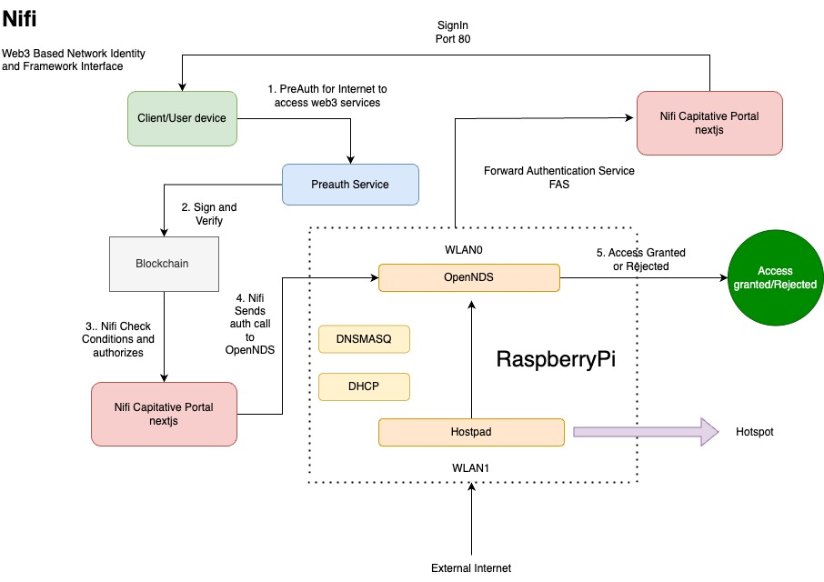

# Nifi: Web3-Based Network Identity and Framework Interface

## Problem Statement

As the demand for decentralized identity solutions grows, traditional WiFi networks lack the ability to authenticate users via blockchain-based assets, such as NFTs and tokens. Existing captive portals focus on centralized methods for access control, leaving out web3 authentication mechanisms, which are becoming increasingly important for modern users who rely on blockchain assets for identification and access to services.If such capitative portal and access flow is built it can provide wide variety of usecases such as pay as you go model through crypto assets, wifi access in airlines through nft tickets and so on...

**Nifi** aims to solve this problem by enabling token-based WiFi authentication through a custom captive portal that leverages Web3 technologies. The system uses NFTs and tokens as access credentials, providing an innovative solution for decentralized network access.

---

## System Overview

**Nifi** integrates blockchain, OpenNDS, and Raspberry Pi to create a decentralized captive portal that authenticates users using ERC20, ERC721, and ERC1155 tokens. It relies on a pre-authentication flow and forward authentication services (FAS) to grant or deny network access.

---

## Technical Implementation


**Hardware & Platform:**
- **Raspberry Pi**: Acts as the central gateway running OpenNDS for managing the captive portal.
- **OpenNDS**: Handles the network access and communicates with Nifi to determine whether access should be granted or denied.
- **DNSMASQ & DHCP**: Manage DNS and IP address assignments on the Raspberry Pi, working in conjunction with OpenNDS.
- **Hostapd**: Provides the wireless access point functionality.

**Software Components:**
- **Next.js**: A React-based framework used for building the Nifi Captive Portal UI, which displays authentication prompts to the users.
- **Preauth Service**: Ensures users are authorized to access web3 services by validating their token ownership.
- **Blockchain Integration**: Nifi checks conditions on the blockchain to verify the user's assets, such as NFTs or tokens, and authorize access based on predefined rules.
- **OpenNDS Integration**: After verification, Nifi interacts with OpenNDS, sending authorization calls that either grant or deny network access.

---

## Workflow

1. **User Connects to WiFi**: A client device connects to the WiFi hotspot served by the Raspberry Pi.
2. **Pre-authentication**: The user attempts to access the internet, which triggers the **Preauth Service**. This service checks whether the user meets the required conditions for accessing web3 services (e.g., owning a specific NFT).
3. **Blockchain Verification**: The user's blockchain assets are verified by the preauth service, ensuring they meet the criteria (e.g., holding a required number of tokens).
4. **Authentication via Nifi**: Nifi checks the user’s blockchain data and token ownership and sends an authorization call to OpenNDS. 
5. **OpenNDS Decision**: OpenNDS receives the authorization and either grants or denies the user access to the internet.
6. **Access Granted or Rejected**: Based on OpenNDS’s decision, the user either gains internet access or is redirected to a rejection page.

---

## Key Features

- **Token-based Authentication**: Nifi leverages blockchain tokens and NFTs as access credentials. Supported tokens include ERC20, ERC721, and ERC1155.
- **Blockchain-Verified Access**: Users must sign and verify their blockchain assets, such as NFTs or tokens, to gain network access.
- **Forward Authentication Service**: OpenNDS’s forward authentication (FAS) is used to securely verify users’ credentials before granting access.
- **Integration with OpenNDS**: The system communicates with OpenNDS, which handles network management and redirects based on the user’s access status.
- **Customizable Rules**: Admins can set custom rules for token-based authentication, such as the type and number of tokens required for access.

---

## Architecture Diagram



The architecture diagram illustrates the interactions between various components:

- **Client/User Device**: Connects to the WiFi network and initiates the pre-authentication process.
- **Preauth Service**: Premetive Internet Grant Access Service built in nodejs.
- **Nifi Captive Portal (Next.js)**: Displays user authentication pages, manages access rules and communicates with OpenNDS.
- **OpenNDS**: Controls network access and grants/rejects user connections based on Nifi’s authorization call.
- **Raspberry Pi**: Acts as the gateway, running OpenNDS, DNSMASQ, DHCP, and Hostapd, to provide a complete network access solution.

## Challenges and Solutions

- **Smooth User Experience**: Ensuring that users experience minimal delays during the sign-in process required optimizing the Next.js interface and ensuring fast blockchain interactions.
- **OpenNDS Integration**: Integrating Nifi with OpenNDS involved understanding the nuances of forward authentication and how it handles network traffic and access decisions.

---

## Future Enhancements

- **Multi-chain Support**: Extend Nifi’s functionality to support tokens and NFTs from multiple blockchains.
- **Token Escrow**: Implement token escrow services where tokens are temporarily locked during a user's session for added security and for pay as you go model.

---

By combining the power of decentralized identity and blockchain with traditional network access, **Nifi** represents a step toward a more secure and user-controlled internet experience.


## Demo video
https://www.loom.com/share/05e377af44174fc4b6e9823f67ba60e9?sid=06403338-0b7b-48ca-b0fa-bb3f1541aadb


## How to setup and Run

### Prerequisites

Before you begin, ensure you have:

- Raspberry Pi running Raspbian OS
- Compatible WiFi adapter for the Raspberry Pi
- Internet connection for initial setup
- Node.js installed for the backend services
- Packages: **OpenNDS**, **hostapd**, **dnsmasq**, **Node.js**

---

### Step 1: Update and Install Required Packages

First, update your package list and install the necessary tools:

```bash
sudo apt-get update
sudo apt-get install hostapd dnsmasq opennds

Enable hostapd and dnsmasq:

sudo systemctl unmask hostapd
sudo systemctl enable hostapd
sudo systemctl enable dnsmasq

### Step 2: Configure hostapd

Configure hostapd to turn your Raspberry Pi into a WiFi hotspot:

sudo nano /etc/hostapd/hostapd.conf

Add the following configuration:

interface=wlan0
driver=nl80211
ssid=nifiPortal
hw_mode=g
channel=7
wmm_enabled=0
macaddr_acl=0
auth_algs=1
ignore_broadcast_ssid=0

Then, point hostapd to this config:

sudo nano /etc/default/hostapd

Set:
DAEMON_CONF="/etc/hostapd/hostapd.conf"

### Step 3: Configure DHCP Server with dnsmasq

Configure dnsmasq for DHCP:

sudo nano /etc/dnsmasq.conf

Add the following:

interface=wlan0
dhcp-range=192.168.150.2,192.168.150.20,255.255.255.0,24h

### Step 4: Assign Static IP to wlan0

Assign a static IP address to wlan0:

ADD:
interface wlan0
static ip_address=192.168.150.1/24


### Step 5: Configure OpenNDS for Captive Portal

Edit the OpenNDS configuration:

sudo nano /etc/opennds/opennds.conf

Set the following options for nifi:

GatewayInterface=wlan0
GatewayAddress=192.168.150.1
ClientIdleTimeout=300
fasport=3000
fas_secure_enabled=1
faskey=mysecretkey
gatewayname=nifiPortal
preauthenticated_users=allow tcp to 192.168.38.210 port 5002


### Step 6: Install Node.js for Backend

Install Node.js for the nifi backend:

Clone the backend repository:

git clone https://github.com/mbcse/nifi.git
cd nifi
npm install
npm start

### Step 8: Start Services
Start the services to make your Raspberry Pi a functional WiFi access point with captive portal:

sudo systemctl start hostapd
sudo systemctl start dnsmasq
sudo systemctl start opennds


